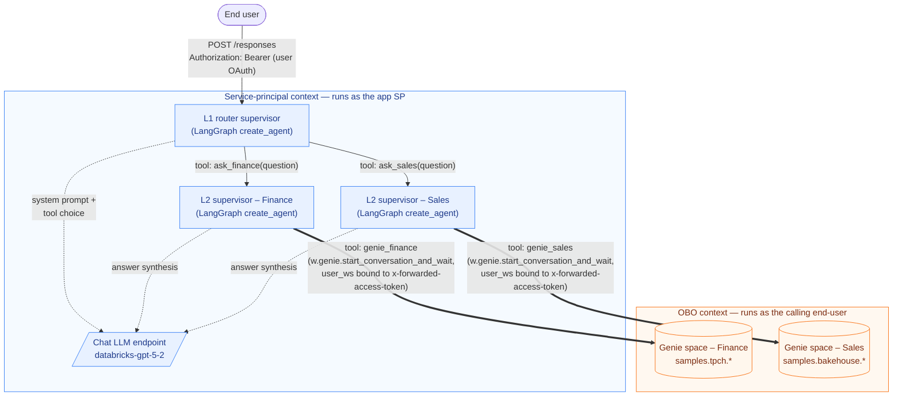
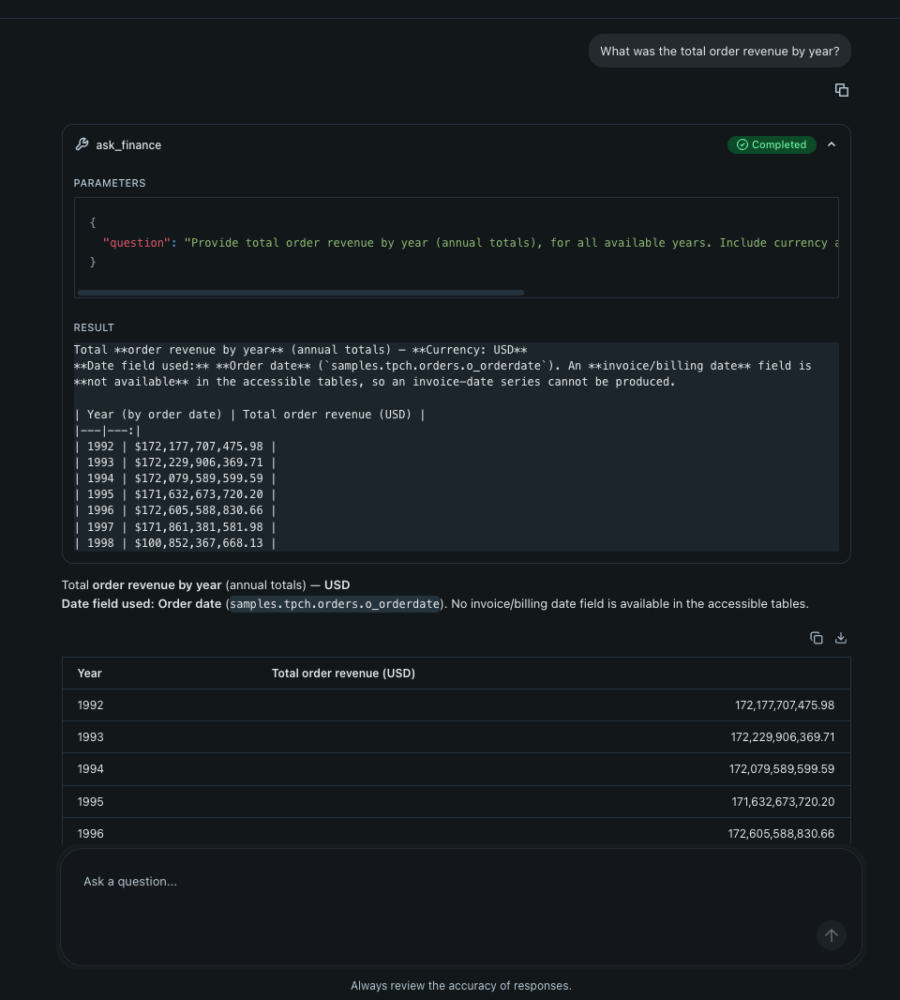

# Hierarchical Supervisor Agent (with Genie OBO)

[](https://github.com/lbruand-db/supervisor-example-obo/actions/workflows/ci.yml)
[](https://www.python.org/)
[](https://github.com/astral-sh/uv)
[](https://github.com/astral-sh/ruff)
[](https://docs.pytest.org/)
[](https://docs.databricks.com/aws/en/dev-tools/databricks-apps/)
[](https://mlflow.org/docs/latest/genai/flavors/responses-agent-intro/)
[](https://www.langchain.com/langgraph)

A Databricks App that hosts a LangChain/LangGraph **hierarchical supervisor**
agent and queries Genie spaces **on behalf of the calling user** (OBO).



**How to read the diagram**

| Element | Identity | Auth mechanism | Notes |
|---|---|---|---|
| Inbound `POST /responses` | End user | OAuth user token in `Authorization` header | Databricks Apps proxy mints the user token and re-forwards it as `x-forwarded-access-token`. |
| L1 / L2 supervisors (blue box) | App service-principal | SP M2M (auto-injected by the platform) | The LangGraph runtime, tool-routing logic, and chat-LLM calls all happen here. Nothing in this box touches user data directly. |
| LLM endpoint calls (dotted edges) | App service-principal | SP M2M | The `databricks-gpt-5-2` serving endpoint is granted `CAN_QUERY` to the app's SP in `databricks.yml`. |
| Solid edges between supervisors | App service-principal | In-process tool call | `ask_finance` / `ask_sales` are plain LangChain tools that invoke a child agent — no network hop, no identity change. |
| Thick edges to Genie spaces | **End user (OBO)** | User OAuth token forwarded via `x-forwarded-access-token` | `agent_server/utils.py:get_user_workspace_client()` builds a `WorkspaceClient(token=fwd_token, auth_type="pat")` per request. The Genie call runs under that identity, so Unity Catalog grants on the underlying tables are enforced per caller. |
| Genie spaces (orange box) | **End user (OBO)** | Same forwarded token | The space itself is declared as an app resource with `CAN_RUN` for the SP, but the *query* against it is run by the user, not the SP. |

> Why the Genie leaf uses `start_conversation_and_wait` instead of the MCP
> route: the Databricks Apps `user_api_scopes` allowlist (`sql`,
> `dashboards.genie`, `files.files`) doesn't include the scope the MCP
> endpoint (`/api/2.0/mcp/genie/{space_id}`) demands, so MCP 403s under
> OBO. See [`SPECS/SPEC.md`](SPECS/SPEC.md) §12 for the full trace.

## Get this running in 5 minutes

Prereqs: `uv`, the Databricks CLI, and access to a workspace where the
`samples.tpch.*` and `samples.bakehouse.*` schemas exist (true on most
recent workspaces) and where you can create an MLflow experiment and SQL
warehouse-backed Genie spaces.

```bash
# 1. Clone + install
git clone https://github.com/lbruand-db/supervisor-example-obo.git
cd supervisor-example-obo
uv sync

# 2. Authenticate against YOUR workspace
databricks auth login --host https://<your-workspace>.cloud.databricks.com -p mine

# 3. Create the demo resources (Genie spaces + MLflow experiment) and
#    write their IDs into .env. Re-running is safe; existing IDs are reused.
uv run setup-demo --profile mine

# 4. Try it locally first (optional but quick).
#    OBO_FALLBACK_TO_DEFAULT=1 in .env lets the user-token path fall back
#    to your CLI auth when x-forwarded-access-token is absent.
uv run start-server &
curl -s -X POST localhost:8000/responses \
  -H 'Content-Type: application/json' \
  -d '{"input":[{"role":"user","content":"Total revenue in samples.tpch.orders?"}]}'

# 5. Deploy to Databricks Apps and start the app.
uv run deploy --profile mine
# Open the URL printed at the end and ask a sample question:
#   "How many sales transactions are there by franchise?"     -> ask_sales
#   "What is the total order revenue by year (samples.tpch)?" -> ask_finance
```

What `setup-demo` creates (all in *your* workspace, all idempotent):

| Resource | How / where |
|---|---|
| MLflow experiment | `/Users/<you>/supervisor-example-obo` for agent traces. |
| Finance Genie space | Backed by `samples.tpch.{orders,lineitem,customer,nation,region}`, attached to the first serverless SQL warehouse it finds. |
| Sales Genie space | Backed by `samples.bakehouse.sales_{transactions,customers,franchises,suppliers}`. |
| `.env` | Adds `MLFLOW_EXPERIMENT_ID` / `GENIE_*_SPACE_ID` for local dev, and `BUNDLE_VAR_*` keys consumed by `uv run deploy`. |

To customize the domains (e.g., replace finance/sales with your own
data), edit `DOMAINS` in `agent_server/agent.py` and the matching prompts
in `agent_server/prompts.py`, then point the bundle at your own Genie
spaces by editing `setup_demo.py`'s `FINANCE_TABLES` / `SALES_TABLES` or
by setting the `GENIE_*_SPACE_ID` values manually in `.env`.

## Alternative: deploy as a Mosaic AI Model Serving endpoint

The same supervisor graph can be served by **Model Serving** instead of
Databricks Apps. Pick this when callers are services / other agents and
you want UC-governed model registration + auto-scale to zero. See
[`SPECS/PLAN_MODEL_SERVING.md`](SPECS/PLAN_MODEL_SERVING.md) for the
full design rationale.

**Prerequisite** (one-time, workspace admin): enable the public preview
**"Agent Framework: On-Behalf-Of-User Authorization"** at
*Workspace Admin → Settings → Previews*. Without it, the per-caller
identity propagation fails at runtime with a clear `ValueError`. The
endpoint must be (re)deployed *after* the toggle for it to take effect.

```bash
# Same setup as the Apps build — populates GENIE_*_SPACE_ID in .env.
uv run setup-demo --profile mine

# Log the model to UC + create/update the serving endpoint.
uv run deploy-serving --profile mine
# Expects SERVING_UC_CATALOG / SERVING_UC_SCHEMA / SERVING_UC_MODEL_NAME /
# SERVING_ENDPOINT_NAME in .env (defaults in .env.example).
```

When the endpoint reaches `READY` (~5–15 min on first deploy), query it
as a user with an OAuth token (PATs don't carry through the serving
proxy):

```bash
HOST=https://<your-workspace>.cloud.databricks.com
TOKEN=$(databricks auth token --host $HOST -p mine | jq -r .access_token)
curl -s -X POST "$HOST/serving-endpoints/supervisor-example-obo-serving/invocations" \
  -H "Authorization: Bearer $TOKEN" -H 'Content-Type: application/json' \
  -d '{"input":[{"role":"user","content":"Total order revenue in samples.tpch.orders?"}]}'
```

The Apps build (`uv run deploy`) and the Serving build (`uv run
deploy-serving`) are independent — you can have both running on the same
workspace and they share the same agent code in `agent_server/`.

## Live deployment

L1 routes a finance question to `ask_finance`, the L2 supervisor calls the
`genie_finance` tool, and Genie returns the per-year revenue from
`samples.tpch.orders` under the calling user's identity:



See [`SPECS/SPEC.md`](SPECS/SPEC.md) for the design, the manifest /
`databricks.yml` mapping, the OBO contract, and the acceptance criteria.

Forked from
[`databricks/app-templates/agent-langgraph`](https://github.com/databricks/app-templates/tree/main/agent-langgraph)
— the scaffolding, chat UI, quickstart, and MLflow `ResponsesAgent` plumbing
are the template's; the agent graph (`agent_server/agent.py`),
prompts (`agent_server/prompts.py`), and resource manifests are this repo's.

---

This template defines a conversational agent app. The app comes with a built-in chat UI, but also exposes an API endpoint for invoking the agent so that you can serve your UI elsewhere (e.g. on your website or in a mobile app).

The agent in this template implements the [OpenAI Responses API](https://platform.openai.com/docs/api-reference/responses) interface. The agent code includes examples showing how to connect to [Databricks MCP servers](https://docs.databricks.com/aws/en/generative-ai/agent-framework/agent-tool) (including the built-in code interpreter, Vector Search, Genie, and UC functions). You can customize agent code and test it via the API or UI.

The agent input and output format are defined by MLflow's ResponsesAgent interface, which closely follows the [OpenAI Responses API](https://platform.openai.com/docs/api-reference/responses) interface. See [the MLflow docs](https://mlflow.org/docs/latest/genai/flavors/responses-agent-intro/) for input and output formats for streaming and non-streaming requests, tracing requirements, and other agent authoring details.

## Build with AI Assistance

We recommend using AI coding assistants (Claude Code, Cursor, GitHub Copilot) to customize and deploy this template. Agent Skills in `.claude/skills/` provide step-by-step guidance for common tasks like setup, adding tools, and deployment. These skills are automatically detected by Claude, Cursor, and GitHub Copilot.

## Quick start

Run the `uv run quickstart` script to quickly set up your local environment and start the agent server. At any step, if there are issues, refer to the manual local development loop setup below.

This script will:

1. Verify uv, nvm, and Databricks CLI installations
2. Configure Databricks authentication
3. Configure agent tracing, by creating and linking an MLflow experiment to your app
4. Start the agent server and chat app

```bash
uv run quickstart
```

After the setup is complete, you can start the agent server and the chat app locally with:

```bash
uv run start-app
```

This will start the agent server and the chat app at http://localhost:8000.

**Next steps**: see [modifying your agent](#modifying-your-agent) to customize and iterate on the agent code.

## Manual local development loop setup

1. **Set up your local environment**
   Install `uv` (python package manager), `nvm` (node version manager), and the Databricks CLI:

   - [`uv` installation docs](https://docs.astral.sh/uv/getting-started/installation/)
   - [`nvm` installation](https://github.com/nvm-sh/nvm?tab=readme-ov-file#installing-and-updating)
     - Run the following to use Node 20 LTS:
       ```bash
       nvm use 20
       ```
   - [`databricks CLI` installation](https://docs.databricks.com/aws/en/dev-tools/cli/install)

2. **Set up local authentication to Databricks**

   In order to access Databricks resources from your local machine while developing your agent, you need to authenticate with Databricks. Choose one of the following options:

   **Option 1: OAuth via Databricks CLI (Recommended)**

   Authenticate with Databricks using the CLI. See the [CLI OAuth documentation](https://docs.databricks.com/aws/en/dev-tools/cli/authentication#oauth-user-to-machine-u2m-authentication).

   ```bash
   databricks auth login
   ```

   Set the `DATABRICKS_CONFIG_PROFILE` environment variable in your .env file to the profile you used to authenticate:

   ```bash
   DATABRICKS_CONFIG_PROFILE="DEFAULT" # change to the profile name you chose
   ```

   **Option 2: Personal Access Token (PAT)**

   See the [PAT documentation](https://docs.databricks.com/aws/en/dev-tools/auth/pat#databricks-personal-access-tokens-for-workspace-users).

   ```bash
   # Add these to your .env file
   DATABRICKS_HOST="https://host.databricks.com"
   DATABRICKS_TOKEN="dapi_token"
   ```

   See the [Databricks SDK authentication docs](https://docs.databricks.com/aws/en/dev-tools/sdk-python#authenticate-the-databricks-sdk-for-python-with-your-databricks-account-or-workspace).

3. **Create and link an MLflow experiment to your app**

   Create an MLflow experiment to enable tracing and version tracking. This is automatically done by the `uv run quickstart` script.

   Create the MLflow experiment via the CLI:

   ```bash
   DATABRICKS_USERNAME=$(databricks current-user me | jq -r .userName)
   databricks experiments create-experiment /Users/$DATABRICKS_USERNAME/agents-on-apps
   ```

   Make a copy of `.env.example` to `.env` and update the `MLFLOW_EXPERIMENT_ID` in your `.env` file with the experiment ID you created. The `.env` file will be automatically loaded when starting the server.

   ```bash
   cp .env.example .env
   # Edit .env and fill in your experiment ID
   ```

   See the [MLflow experiments documentation](https://docs.databricks.com/aws/en/mlflow/experiments#create-experiment-from-the-workspace).

4. **Test your agent locally**

   Start up the agent server and chat UI locally:

   ```bash
   uv run start-app
   ```

   Query your agent via the UI (http://localhost:8000) or REST API:

   **Advanced server options:**

   ```bash
   uv run start-server --reload   # hot-reload the server on code changes
   uv run start-server --port 8001 # change the port the server listens on
   uv run start-server --workers 4 # run the server with multiple workers
   ```

   - Example streaming request:
     ```bash
     curl -X POST http://localhost:8000/invocations \
     -H "Content-Type: application/json" \
     -d '{ "input": [{ "role": "user", "content": "hi" }], "stream": true }'
     ```
   - Example non-streaming request:
     ```bash
     curl -X POST http://localhost:8000/invocations  \
     -H "Content-Type: application/json" \
     -d '{ "input": [{ "role": "user", "content": "hi" }] }'
     ```

## Modifying your agent

See the [LangGraph documentation](https://docs.langchain.com/oss/python/langgraph/quickstart) for more information on how to edit your own agent.

Required files for hosting with MLflow `AgentServer`:

- `agent.py`: Contains your agent logic. Modify this file to create your custom agent. For example, you can [add agent tools](https://docs.databricks.com/aws/en/generative-ai/agent-framework/agent-tool) to give your agent additional capabilities
- `start_server.py`: Initializes and runs the MLflow `AgentServer` with agent_type="ResponsesAgent". You don't have to modify this file for most common use cases, but can add additional server routes (e.g. a `/metrics` endpoint) here

**Common customization questions:**

**Q: Can I add additional files or folders to my agent?**
Yes. Add additional files or folders as needed. Ensure the script within `pyproject.toml` runs the correct script that starts the server and sets up MLflow tracing.

**Q: How do I add dependencies to my agent?**
Run `uv add <package_name>` (e.g., `uv add "mlflow-skinny[databricks]"`). See the [python pyproject.toml guide](https://packaging.python.org/en/latest/guides/writing-pyproject-toml/#dependencies-and-requirements).

**Q: Can I add custom tracing beyond the built-in tracing?**
Yes. This template uses MLflow's agent server, which comes with automatic tracing for agent logic decorated with `@invoke()` and `@stream()`. It also uses [MLflow autologging APIs](https://mlflow.org/docs/latest/genai/tracing/#one-line-auto-tracing-integrations) to capture traces from LLM invocations. However, you can add additional instrumentation to capture more granular trace information when your agent runs. See the [MLflow tracing documentation](https://docs.databricks.com/aws/en/mlflow3/genai/tracing/app-instrumentation/).

**Q: How can I extend this example with additional tools and capabilities?**
This template can be extended by integrating additional MCP servers, Vector Search Indexes, UC Functions, and other Databricks tools. See the ["Agent Framework Tools Documentation"](https://docs.databricks.com/aws/en/generative-ai/agent-framework/agent-tool).

## Evaluating your agent

Evaluate your agent by calling the invoke function you defined for the agent locally.

- Update your `evaluate_agent.py` file with the preferred evaluation dataset and scorers.

Run the evaluation using the evaluation script:

```bash
uv run agent-evaluate
```

After it completes, open the MLflow UI link for your experiment to inspect results.

## Deploying to Databricks Apps

This template uses [Databricks Asset Bundles (DABs)](https://docs.databricks.com/aws/en/dev-tools/bundles/) for deployment. The `databricks.yml` file defines the app configuration and resource permissions.

> **`app.yaml` vs `databricks.yml`**: `app.yaml` is used when deploying via `databricks apps deploy` (manual path). When deploying via DABs (`databricks bundle deploy`), the `config:` section in `databricks.yml` takes precedence. If you change environment variables or the start command, update `databricks.yml` — that's what DABs reads.

Ensure you have the [Databricks CLI](https://docs.databricks.com/aws/en/dev-tools/cli/tutorial) installed and configured.

1. **Run the pre-flight check**

   Start the agent locally, send a test request, and verify the response to catch configuration and code errors early:

   ```bash
   uv run preflight
   ```

2. **Validate the bundle configuration**

   Catch any configuration errors before deploying:

   ```bash
   databricks bundle validate
   ```

3. **Deploy the bundle**

   This uploads your code and configures resources (MLflow experiment, serving endpoints, etc.) defined in `databricks.yml`:

   ```bash
   databricks bundle deploy
   ```

4. **Start or restart the app**

   ```bash
   databricks bundle run agent_langgraph
   ```

   > **Note:** `bundle deploy` only uploads files and configures resources. `bundle run` is **required** to actually start/restart the app with the new code.

   To grant access to additional resources (serving endpoints, genie spaces, UC Functions, Vector Search), add them to `databricks.yml` and redeploy. See the [Databricks Apps resources documentation](https://docs.databricks.com/aws/en/dev-tools/databricks-apps/resources).

   **On-behalf-of (OBO) User Authentication**: Use `get_user_workspace_client()` from `agent_server.utils` to authenticate as the requesting user instead of the app service principal. See the [OBO authentication documentation](https://docs.databricks.com/aws/en/dev-tools/databricks-apps/auth?language=Streamlit#retrieve-user-authorization-credentials).

5. **Query your agent hosted on Databricks Apps**

   You must use a Databricks OAuth token to query agents hosted on Databricks Apps. See [Query an agent](https://docs.databricks.com/aws/en/generative-ai/agent-framework/query-agent) for full details.

   **Using the Databricks OpenAI client (Python):**

   ```bash
   uv pip install databricks-openai
   ```

   ```python
   from databricks.sdk import WorkspaceClient
   from databricks_openai import DatabricksOpenAI

   w = WorkspaceClient()
   client = DatabricksOpenAI(workspace_client=w)

   # Non-streaming
   response = client.responses.create(
       model="apps/<app-name>",
       input=[{"role": "user", "content": "hi"}],
   )
   print(response)

   # Streaming
   streaming_response = client.responses.create(
       model="apps/<app-name>",
       input=[{"role": "user", "content": "hi"}],
       stream=True,
   )
   for chunk in streaming_response:
       print(chunk)
   ```

   **Using curl:**

   ```bash
   # Generate an OAuth token
   databricks auth login --host <https://host.databricks.com>
   databricks auth token
   ```

   ```bash
   # Streaming request
   curl --request POST \
     --url <app-url>.databricksapps.com/responses \
     --header "Authorization: Bearer <oauth-token>" \
     --header "Content-Type: application/json" \
     --data '{
       "input": [{ "role": "user", "content": "hi" }],
       "stream": true
     }'
   ```

   ```bash
   # Non-streaming request
   curl --request POST \
     --url <app-url>.databricksapps.com/responses \
     --header "Authorization: Bearer <oauth-token>" \
     --header "Content-Type: application/json" \
     --data '{
       "input": [{ "role": "user", "content": "hi" }]
     }'
   ```

For future updates, run `databricks bundle deploy` and `databricks bundle run agent_langgraph` to redeploy.

### Common Issues

- **`databricks bundle deploy` fails with "An app with the same name already exists"**

  This happens when an app with the same name was previously created outside of DABs. To fix, bind the existing app to your bundle:

  ```bash
  # 1. Get the existing app's config (note the budget_policy_id if present)
  databricks apps get <app-name> --output json | jq '{name, budget_policy_id, description}'

  # 2. Update databricks.yml to include budget_policy_id if it was returned above

  # 3. Bind the existing app to your bundle
  databricks bundle deployment bind agent_langgraph <app-name> --auto-approve

  # 4. Deploy
  databricks bundle deploy
  ```

  Alternatively, delete the existing app and deploy fresh: `databricks apps delete <app-name>` (this permanently removes the app's URL and service principal).

- **`databricks bundle deploy` fails with "Provider produced inconsistent result after apply"**

  The existing app has server-side configuration (like `budget_policy_id`) that doesn't match your `databricks.yml`. Run `databricks apps get <app-name> --output json` and sync any missing fields to your `databricks.yml`.

- **App is running old code after `databricks bundle deploy`**

  `bundle deploy` only uploads files and configures resources. You must run `databricks bundle run agent_langgraph` to actually start/restart the app with the new code.

### FAQ

- For a streaming response, I see a 200 OK in the logs, but an error in the actual stream. What's going on?
  - This is expected behavior. The initial 200 OK confirms stream setup; streaming errors don't affect this status.
- When querying my agent, I get a 302 error. What's going on?
  - Use an OAuth token. PATs are not supported for querying agents.
