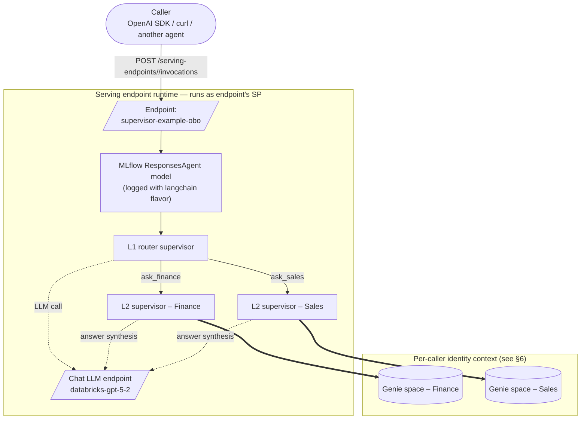

# PLAN — Port the supervisor agent to a Model Serving endpoint

This is a **plan**, not an implementation. It describes how to take the
current Databricks Apps deployment of the L1→L2→Genie supervisor and
re-deploy the same agent as a Mosaic AI **Model Serving endpoint** behind
an MLflow `ResponsesAgent` model. The branch that does this work should
land alongside the current Apps build (likely on a `serving/` branch or as
a second target in the bundle), not replace it.

Cross-references: [`SPEC.md`](SPEC.md) for the existing design; the rules
about OBO at the leaf (§5) and the documented scope allowlist (§6.1, §12)
still apply.

---

## 1. Goal

Expose the same `/responses`-compatible agent at
`https://<workspace>/serving-endpoints/supervisor-example-obo/invocations`
(OpenAI Responses-compatible), with:

- The same L1→L2→Genie graph code reused unchanged.
- Per-caller identity preserved for Genie reads (so UC grants on the
  underlying tables still gate access — this is the key OBO requirement
  and the main open question of the port; see §6).
- One bundle target (`-t serving`) that builds, logs, registers, and
  deploys the endpoint end-to-end via `databricks bundle deploy`.

Non-goal: deprecating the Apps deployment. Apps + Serving are
complementary; this plan exists so customers can pick whichever fits.

## 2. Why bother — trade-offs vs the Apps deployment

| Concern | Databricks App (today) | Model Serving (this plan) |
|---|---|---|
| Where the agent loop runs | App process (uvicorn) | Serving endpoint runtime (managed) |
| Scaling | App compute size, manual | Workload size + scale-to-zero |
| Cold start | App stays warm if compute is up | Cold-start cost on scale-to-zero |
| Built-in UI | Chat UI ships in the app | AI Playground / Review App |
| Caller identity | `x-forwarded-access-token` forwarded as-is | Constrained — see §6 |
| Eval / MLflow lineage | App writes traces to experiment | First-class; endpoint version = model version |
| Packaging | `source_code_path: ./` | Logged MLflow model in UC |
| OpenAI-client interop | Yes (via app URL) | Yes (via endpoint URL, no Apps proxy hop) |
| Deployment surface | Apps OAuth + workspace | UC catalog grants + workspace |

Pick Serving when callers are **other services** or **agents**. Pick Apps
when callers are **humans in a browser**.

## 3. Target architecture



## 4. What changes vs the Apps build

### 4.1 Reused as-is

- `agent_server/prompts.py` — system prompts.
- `agent_server/agent.py` — the `DOMAINS` list, `_build_genie_tool`,
  `_build_l2_supervisor`, `build_l1_agent`, `_make_l1_tool`. The shape
  stays. **Only the identity binding changes (see §6).**
- `tests/test_agent_wiring.py` — still validates the graph; expect to add
  one test for the serving-side identity helper.

### 4.2 Replaced

- `agent_server/start_server.py` and the FastAPI/`mlflow.genai.agent_server`
  decorators. Serving endpoints don't run a FastAPI process — the agent is
  the model and MLflow's `ResponsesAgent` serialization handles request
  framing. Replace with `agent_server/responses_agent.py` that subclasses
  `mlflow.pyfunc.ResponsesAgent` and exposes `predict` and `predict_stream`.
- `app.yaml`, the apps frontend, `scripts/start_app.py` — drop for this
  target.
- `agent_server/utils.py:get_user_workspace_client` — the
  `x-forwarded-access-token` header doesn't exist at the serving endpoint.
  Replace with whatever the agreed-on OBO mechanism turns out to be
  (§6) — keep the same function name so the rest of `agent.py` doesn't
  change.

### 4.3 Added

- `agent_server/responses_agent.py` — `ResponsesAgent` subclass. Roughly:

  ```python
  from mlflow.pyfunc import ResponsesAgent
  from mlflow.types.responses import ResponsesAgentRequest, ResponsesAgentResponse

  class SupervisorResponsesAgent(ResponsesAgent):
      def predict(self, request: ResponsesAgentRequest) -> ResponsesAgentResponse:
          user_ws = get_user_workspace_client(request)  # §6
          agent = build_l1_agent(user_ws)
          # invoke + collect outputs (sync wrapper around the existing
          # `.ainvoke()` graph)

      def predict_stream(self, request):
          ...
  ```

- `scripts/log_model.py` — logs the model with MLflow, registers it to UC,
  and declares the Databricks resources it needs:

  ```python
  import mlflow
  from mlflow.models.resources import (
      DatabricksGenieSpace, DatabricksServingEndpoint,
  )
  from agent_server.responses_agent import SupervisorResponsesAgent

  with mlflow.start_run():
      mlflow.langchain.log_model(
          lc_model="agent_server.agent",   # or python_model=SupervisorResponsesAgent()
          name="supervisor_example_obo",
          resources=[
              DatabricksGenieSpace(genie_space_id=GENIE_FINANCE_ID),
              DatabricksGenieSpace(genie_space_id=GENIE_SALES_ID),
              DatabricksServingEndpoint(endpoint_name=LLM_ENDPOINT),
          ],
          registered_model_name=f"{CATALOG}.{SCHEMA}.supervisor_example_obo",
      )
  ```

  Resource declarations matter: Mosaic AI uses them to provision the
  endpoint's SP with `CAN_RUN` on the Genie spaces and `CAN_QUERY` on the
  LLM endpoint without requiring a human to grant them after deploy.

- `databricks.yml` (new bundle target): declares `registered_models` (UC),
  the bundle variable for `catalog.schema.model_name`, and a
  `serving_endpoints` resource bound to the latest model version with
  `workload_size: Small`, `scale_to_zero_enabled: true`.

- `scripts/deploy_serving.py` — sister to `scripts/deploy.py`. Loads
  `.env`, runs `uv run python -m scripts.log_model` to log and register
  the model, then `databricks bundle deploy -t serving` to update the
  endpoint.

### 4.4 Bundle layout sketch

```yaml
variables:
  uc_catalog:
    default: "main"
  uc_schema:
    default: "default"
  registered_model_name:
    default: "supervisor_example_obo"

targets:
  serving:
    mode: development
    resources:
      registered_models:
        supervisor_model:
          catalog_name: ${var.uc_catalog}
          schema_name: ${var.uc_schema}
          name: ${var.registered_model_name}
      serving_endpoints:
        supervisor_endpoint:
          name: supervisor-example-obo
          config:
            served_entities:
              - entity_name: ${var.uc_catalog}.${var.uc_schema}.${var.registered_model_name}
                entity_version: "${latest}"       # or pinned per-deploy
                workload_size: "Small"
                scale_to_zero_enabled: true
```

## 5. Local dev loop

1. `uv sync`
2. `uv run setup-demo --profile mine` — same as today; provisions the
   two Genie spaces and an MLflow experiment.
3. `uv run log-model --profile mine` — logs the agent and prints the new
   UC model version. (Use the MLflow `predict_stream` locally to smoke
   the graph without standing up an endpoint.)
4. `uv run deploy-serving --profile mine` — bundle deploy of the serving
   target. First deploy takes minutes (endpoint provisioning); updates
   are seconds (new model version, hot-swap).
5. Smoke:

   ```bash
   databricks serving-endpoints query supervisor-example-obo \
     --request '{"input":[{"role":"user","content":"YTD revenue by year?"}]}'
   ```

## 6. OBO at the serving endpoint — **open question**

This is the single biggest design risk and the part of the port that needs
real prototyping before any of the other work is worth doing.

**The Apps path used today** — `x-forwarded-access-token` set by the
platform proxy, lifted into a `WorkspaceClient(token=..., auth_type="pat")`,
which the Genie SDK then uses. That header **does not exist** at a Model
Serving endpoint.

**Candidate mechanisms** to evaluate, in order of preference:

1. **Mosaic AI "Agent on-behalf-of-user" auth** *(preferred if available
   in this workspace)*. The endpoint is created with
   `endpoint_role=END_USER` (or whatever the GA name is), and the model
   code calls a helper such as
   `databricks_agents.runtime.get_user_workspace_client()` to obtain a
   client scoped to the caller. Verify what `mlflow_models.resources` +
   `databricks.agents.deploy` actually wire up — the API surface has
   churned. If this works, `get_user_workspace_client(request)` becomes
   a one-line shim and the agent code in §4.1 is reused literally
   unchanged.

2. **Workspace OBO via `Authorization` header passthrough**. Some
   serving-endpoint runtimes expose the caller's bearer in
   `request.context.databricks_user_token` (or equivalent). If true, we
   take the same `auth_type="pat"` approach as the Apps build. Risk:
   tokens may already be downscoped at the endpoint boundary, with the
   same allowlist issue we hit in [SPEC.md §12](SPEC.md).

3. **Endpoint SP only, no OBO** *(fallback, not the goal)*. The endpoint
   runs every Genie query under the endpoint's own SP — UC grants are no
   longer per-caller. We'd lose the security story. Only ship this if
   options 1 and 2 are blocked.

**Action**: before any of the implementation work, spike a one-screen
`ResponsesAgent` model that just returns
`{"identity": request.context.<whatever>}` and deploy it on a serving
endpoint. Verify the caller's identity is actually reachable; only then
proceed.

## 7. Resources mapping

| Concern | Apps build today | Serving build |
|---|---|---|
| Genie space access | `genie_space: { permission: CAN_RUN }` for the app's SP in `databricks.yml` | `DatabricksGenieSpace` in `mlflow.models.resources` at log time + (probably) re-listed under the endpoint's `served_entities` |
| Experiment | App resource | `experiment` resource on the bundle (still scope-of-bundle, not the endpoint) |
| LLM endpoint | App resource (CAN_QUERY) | `DatabricksServingEndpoint` in model resources |
| OAuth scopes | `user_api_scopes: [dashboards.genie, sql]` in `databricks.yml` | Not applicable — Apps construct, no equivalent on serving endpoints |

## 8. What we lose

- The bundled chat UI. Customers using a browser would talk to the
  endpoint via **AI Playground** or the **MLflow Review App**.
- Per-request browser-OAuth context (Apps' `x-forwarded-access-token` is
  the cleanest OBO surface Databricks ships). Whatever mechanism §6
  picks will be more constrained.
- Mid-request streaming over WebSocket — serving endpoints support SSE
  via `predict_stream`, so streaming itself stays.

## 9. Acceptance criteria

- [ ] §6 spike: caller identity is reachable inside the served model.
      Document which mechanism worked and link to the Databricks doc.
- [ ] `uv run deploy-serving --profile mine` creates / updates the
      endpoint end-to-end on a clean checkout (idempotent).
- [ ] `databricks serving-endpoints query supervisor-example-obo …`
      returns a routed answer for a finance prompt **and** for a sales
      prompt.
- [ ] Two end-users with different UC grants on the same Genie space see
      different result sets via the endpoint (proves OBO survived).
- [ ] Adding a third domain still only requires editing `DOMAINS` in
      `agent.py`, adding the prompt, and adding the resource to the
      `log_model` call. No graph rewiring.
- [ ] `evaluate_agent.py` runs against the endpoint URL the same way it
      runs against `localhost:8000` today (swap `predict_fn`).

## 10. Open questions

- Which OBO mechanism (§6) actually works on the target workspace? Spike
  before committing to the rest.
- Where does the agent run when the endpoint scales to zero — cold start
  cost relative to the warmed Apps process. Measure before promising a
  customer "this is faster."
- `mlflow.langchain.log_model` vs `mlflow.pyfunc.log_model` with a
  hand-written `ResponsesAgent` subclass: the first is shorter; the
  second is more explicit. Default to subclassing if the LangChain
  autolog path drops trace metadata.
- Are Genie spaces and the LLM endpoint the only resources the agent
  touches, or should we also declare `DatabricksTable` for the
  underlying UC tables (Mosaic AI permissions docs are inconsistent)?
- Can a single bundle host **both** the App target and the Serving
  target, with shared `variables:` (Genie space IDs, experiment id)? If
  yes, that's what to ship; if no, fork the bundle.
